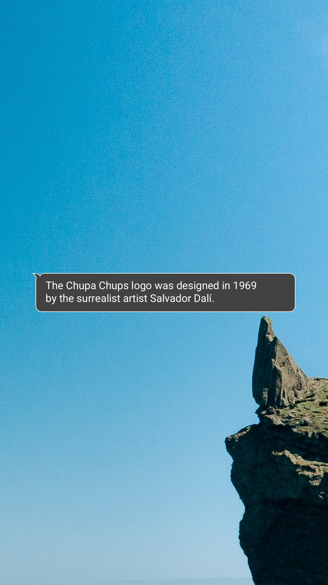

# WallFact

<h3>What it does:</h3>
Renders random facts on random images in bubble style.

* Facts source: local DB  
* Images source: Unsplash with local cache

<h3>Usage:</h3>
Simple. Set needed connection params and run -> web server will start

<h3>Example:</h3>

